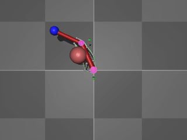
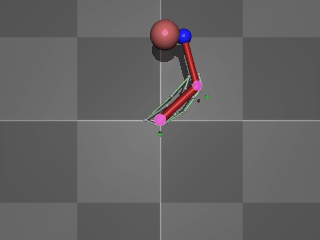
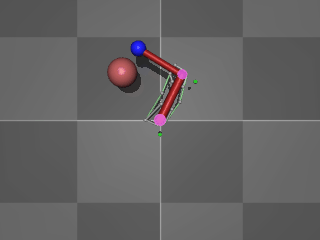
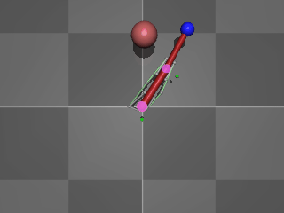
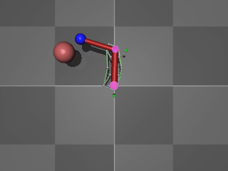
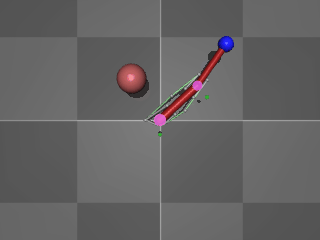

# ACME-compatible implementation of Arm26 from Mujoco

This repository contains a customized implementation of Mujoco's Arm26 model, 
that can be used with DeepMind's ACME framework to train a Reinforcement Learning agent. This is a
more biologically realistic and more challenging effector to train than the typical *reacher* environment included in
the original package.

This code is provided as-is, but feel free to log any issue if you find one. Any contribution is greatly appreciated.

## Dependencies

The model relies on 
<a href="https://github.com/deepmind/dm_control" alt="dm-control-github-link"> 
dm_control
</a>,
as well as any dependencies dm_control may have, most notably a working 
<a href="https://mujoco.org/" alt="Mujoco-website">
Mujoco
</a>
installation. 

## Usage
Import to your code via a normal import command ```import arm26```. Make sure ```arm26.xml``` and ```arm26.py``` are in
the same folder.

You can create the enviroment by calling
~~~
import arm26

environment = arm26.load(task_name)
~~~

The syntax is the same as for ```dm_control.suite.load```, with the first argument (```domain_name```) being omitted.


## Rendering

Below are examples showing that each of the six muscles work properly.

### Shoulder extensor



### Shoulder flexor



### Elbow extensor



### Elbow flexor



### Bi-articular extensor



### Bi-articular flexor




